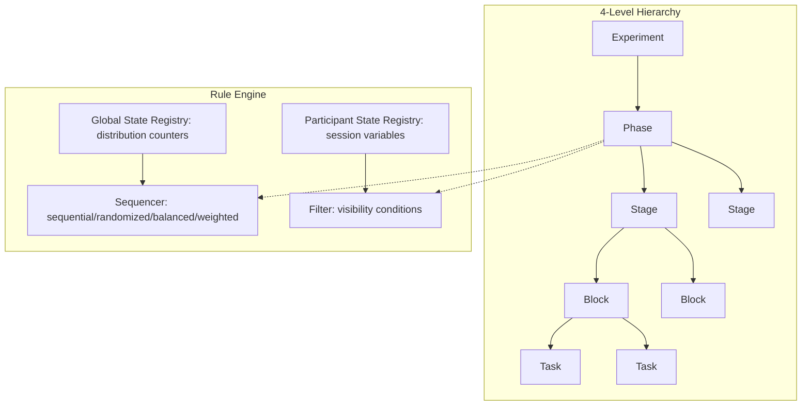
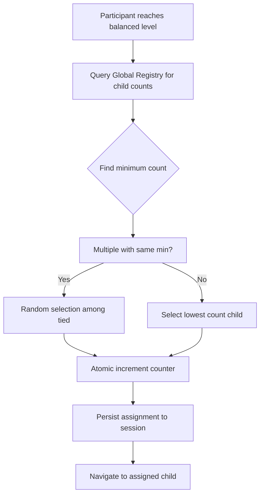
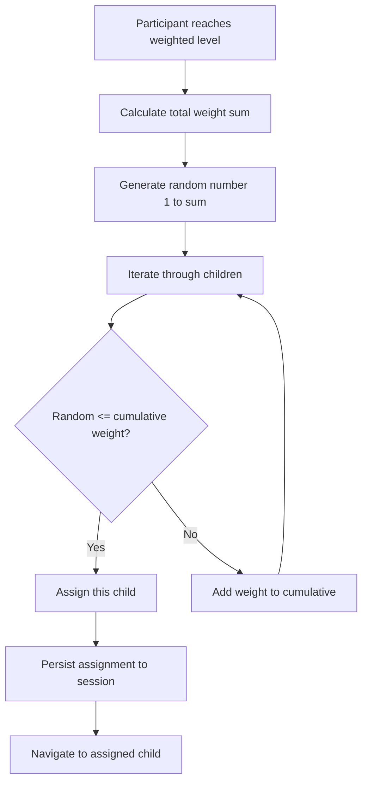

# 4-Level Experiment Hierarchy Implementation Plan

## Current State Summary

The platform currently uses a **flat `stages` array** with optional one-level `substages` nesting. Key files:

- Backend models: [`backend/app/models/experiment.py`](backend/app/models/experiment.py) - `StageConfig` with `substages`
- Rule engine: [`backend/app/services/visibility_engine.py`](backend/app/services/visibility_engine.py) - Simple expression evaluation
- Session manager: [`backend/app/services/session_manager.py`](backend/app/services/session_manager.py) - Flat stage tracking
- Admin GUI: [`frontend/admin-dashboard/src/components/stage-tabs-editor.tsx`](frontend/admin-dashboard/src/components/stage-tabs-editor.tsx) - Tab-based editor
- Participant sidebar: [`frontend/experiment-shell/src/components/Sidebar.tsx`](frontend/experiment-shell/src/components/Sidebar.tsx) - Flat list

---

## Architecture Overview



---

## Phase 1: Backend Schema and Models

Update the core data models to support the 4-level hierarchy.

### 1.1 New YAML Schema Structure

```yaml
experiment:
  id: "study_01"
  phases:
        - id: "onboarding"
      rules:
        ordering: sequential
        visibility: "true"
      ui_settings:
        visible_to_participant: true
      stages:
                - id: "consent_stage"
          rules:
            ordering: sequential
          blocks:
                        - id: "consent_block"
              rules:
                visibility: "participant_age >= 18"
              tasks:
                                - id: "consent_form"
                  type: "consent_form"
                  # ... task config
```


### 1.2 Model Changes

Create new Pydantic models in [`backend/app/models/experiment.py`](backend/app/models/experiment.py):

- `OrderingMode`: Enum with `sequential`, `randomized`, `balanced`, `weighted`
- `RulesConfig`: ordering mode, visibility expression, balance_on, weights[], metadata tags
- `WeightConfig`: id, value (for weighted distribution)
- `UISettings`: visible_to_participant, show_in_sidebar, label overrides
- `TaskConfig`: Rename current `StageConfig` fields for atomic tasks
- `BlockConfig`: Contains tasks[], rules, ui_settings
- `StageConfig`: Contains blocks[], rules, ui_settings  
- `PhaseConfig`: Contains stages[], rules, ui_settings
- Update `ExperimentConfig`: Replace `stages[]` with `phases[]`

### 1.3 Session Model Updates

Update [`backend/app/models/session.py`](backend/app/models/session.py):

- Add hierarchical path tracking: `current_phase_id`, `current_stage_id`, `current_block_id`, `current_task_id`
- Add `randomization_seed` for reproducible shuffling
- Add `assignments` dict to persist balanced/weighted choices
- Update `stage_progress` to `hierarchy_progress` with nested structure

---

## Phase 2: Distribution and Sequencing Engine

### 2.1 Ordering Modes

Create [`backend/app/services/sequencer.py`](backend/app/services/sequencer.py):| Mode | Logic | Use Case ||------|-------|----------|| **Sequential** | Fixed order (1, 2, 3...) | Default linear flow || **Randomized** | Seeded shuffle per participant | Within-subjects counterbalancing || **Balanced** | Least-filled algorithm for equal groups | Between-subjects designs || **Weighted** | Probability-based assignment (70/30) | A/B testing, pilot features |

### 2.2 Balanced Distribution ("Least-Filled" Algorithm)



**YAML Configuration:**

```yaml
- id: "experimental_treatment"
  rules:
    ordering: balanced
    balance_on: "started"  # Options: "started" or "completed"
```

**Balance_on Logic:**

- `started`: Increment counter when participant enters (prevents immediate re-assignment, but slot wasted on dropout)
- `completed`: Increment when participant finishes (accurate but can over-fill during concurrent access)
- **Recommendation**: Use `started` with timeout - if participant doesn't finish within configured time, decrement counter

### 2.3 Weighted Distribution (Probability Engine)



**YAML Configuration:**

```yaml
- id: "ui_variant_test"
  rules:
    ordering: weighted
    weights:
            - id: "variant_a"
        value: 70  # 70% probability
            - id: "variant_b"
        value: 20  # 20% probability
            - id: "variant_c"
        value: 10  # 10% probability
```


### 2.4 Latin Square (Order Balancing)

For counterbalancing order effects when all children must be shown but in different sequences:

```yaml
- id: "task_battery"
  rules:
    ordering: latin_square  # Additional mode
    # System auto-generates permutations and balances assignment
```

**Logic**: If 3 children (A, B, C), system creates 3 orderings and assigns each to ~33% of participants:

- Order 1: A -> B -> C
- Order 2: B -> C -> A  
- Order 3: C -> A -> B

### 2.5 Enhanced Visibility Engine

Update [`backend/app/services/visibility_engine.py`](backend/app/services/visibility_engine.py):

- Add `contains` operator for array checks
- Add `AND`/`OR` keyword support (in addition to `&&`/`||`)
- Implement inheritance rule: parent `visibility: false` prunes entire branch
- Add quota-based visibility checks

---

## Phase 3: Global and Participant State Registries

### 3.1 Global State Registry

Create [`backend/app/services/global_registry.py`](backend/app/services/global_registry.py):Tracks experiment-wide counters for distribution:| Field | Type | Description ||-------|------|-------------|| `item_id` | string | Phase/Stage/Block/Task ID || `experiment_id` | string | Parent experiment || `started_count` | int | Participants who entered || `completed_count` | int | Participants who finished || `target_quota` | int | Optional max limit || `last_updated` | datetime | For timeout cleanup |**MongoDB Collection**: `distribution_counters`**Concurrency Handling**:

- Use `findOneAndUpdate` with `$inc` for atomic increments
- Implement row-level locking pattern for balanced assignment

### 3.2 Participant State Registry

Create [`backend/app/services/participant_registry.py`](backend/app/services/participant_registry.py):Centralized JSON object per session containing:

```json
{
  "participant": {
    "age": 25,
    "gender": "female",
    "group": "treatment"
  },
  "environment": {
    "device": "desktop",
    "browser": "chrome",
    "timestamp": "2026-01-15T10:30:00Z"
  },
  "responses": {
    "consent_form": { "agreed": true },
    "demographics": { "age": 25, "gender": "female" }
  },
  "scores": {
    "attention_score": 0.85,
    "total_correct": 7
  },
  "assignments": {
    "treatment_stage": "variant_a",
    "task_order": ["task_c", "task_a", "task_b"]
  }
}
```

**Features**:

- Real-time scoring calculations
- Redis-backed for performance
- Persisted to MongoDB for recovery

### 3.3 State Rehydration

When participant returns (page refresh, device change):

1. Load persisted `assignments` from session document
2. Do NOT re-evaluate distribution rules
3. Restore exact same path they were assigned

---

## Phase 4: Session Manager Refactor

Update [`backend/app/services/session_manager.py`](backend/app/services/session_manager.py):

### 4.1 Hierarchical Navigation

- `_compute_execution_tree()`: Build ordered, filtered tree from hierarchy + rules
- `_evaluate_ordering()`: Apply sequencing mode to generate child order
- `_navigate_next()`: Traverse tree respecting parent-child relationships
- `_navigate_back()`: Reverse traversal with state preservation

### 4.2 Lazy Evaluation

- Evaluate visibility rules at the moment participant reaches each level
- Re-compute visible items after each submission (allows dynamic branching)
- For balanced/weighted: evaluate once, persist, never re-evaluate

### 4.3 Seed and Assignment Persistence

- Store `randomization_seed` in session document
- Store `assignments` dict with all balanced/weighted choices
- Restore identical state on page refresh/session recovery

---

## Phase 5: Admin GUI - Tree Editor

### 5.1 Tree-Folder Component

Create [`frontend/admin-dashboard/src/components/hierarchy-tree-editor.tsx`](frontend/admin-dashboard/src/components/hierarchy-tree-editor.tsx):

- Collapsible folder structure for Phase/Stage/Block
- Visual icons indicating ordering mode:
- Sequential: arrow icon
- Randomized: shuffle icon
- Balanced: scale/balance icon
- Weighted: percentage icon
- Badge showing visibility rules active
- Expand/collapse all functionality

### 5.2 Drag-and-Drop Reordering

- Drag Tasks between Blocks
- Drag Blocks between Stages
- Drag Stages between Phases
- Validation: prevent invalid nesting (e.g., Task directly under Phase)

### 5.3 Context Menu (3-dots)

- **"Edit Rules"** -> Opens panel for:
- Ordering mode selector (sequential/randomized/balanced/weighted)
- Balance_on toggle (started/completed)
- Weight configuration for weighted mode
- Visibility rule editor (YAML)
- **"View Distribution"** -> Real-time chart showing:
- Current counts per child
- Target quotas
- Active participants in each path
- **"Reset Counters"** -> Clear distribution counts (for trial restart)
- **"Manual Override"** -> Force-assign count adjustments
- **"Move to Top"** / **"Move to Bottom"**
- **"Duplicate"** (deep copy with new IDs)
- **"Delete"**

### 5.4 GUI Schema Updates

Update [`frontend/admin-dashboard/src/lib/gui-schema.ts`](frontend/admin-dashboard/src/lib/gui-schema.ts):

- Add `PHASE_FIELDS`, `BLOCK_FIELDS` definitions
- Add `RULES_FIELDS`:
- ordering: select (sequential/randomized/balanced/weighted/latin_square)
- balance_on: select (started/completed)
- weights: array of {id, value}
- visibility: text (expression)
- metadata: key-value pairs
- Update `STAGE_TYPE_CONFIGS` structure

---

## Phase 6: Participant UI - Dynamic Sidebar

### 6.1 Hierarchical Sidebar

Update [`frontend/experiment-shell/src/components/Sidebar.tsx`](frontend/experiment-shell/src/components/Sidebar.tsx):

- Render Phases as collapsible headers
- Nest Stages under Phase headers
- Show/hide based on `visible_to_participant` flags
- **Only display assigned path** - if weighted to Variant A, never show Variant B
- Auto-collapse completed sections

### 6.2 Progress Tracking

- Checkmarks at each completed level (Phase, Stage, Block)
- Visual indication of current position in hierarchy
- Smart skipping: if Block has 1 Task and Stage has `visible_to_participant: false`, skip that level

### 6.3 Session Store Updates

Update [`frontend/experiment-shell/src/store/sessionStore.ts`](frontend/experiment-shell/src/store/sessionStore.ts):

- Add hierarchical state tracking
- Store `assignments` for path persistence
- Update progress calculation for nested structure

---

## Phase 7: Debug Panel (State Registry Viewer)

### 7.1 Admin Debug API

Add endpoints in [`backend/app/api/monitoring.py`](backend/app/api/monitoring.py):

- `GET /sessions/{session_id}/state-registry` - Full participant state registry
- `GET /experiments/{experiment_id}/distribution` - Global distribution counters
- Admin-only authentication

### 7.2 Debug Panel Component

Create [`frontend/admin-dashboard/src/components/state-registry-panel.tsx`](frontend/admin-dashboard/src/components/state-registry-panel.tsx):**Participant Debugging:**

- Searchable/filterable variable list
- Show current values alongside rule expressions
- Highlight why specific items are visible/hidden

**Distribution Debugging:**

- Show assignment reasoning:
- Balanced: "Stage_A_Count: 15, Stage_B_Count: 14 -> Assigned Stage_B"
- Weighted: "Random_Roll: 42, Range: [1-70] -> Assigned Variant_A"
- Display Latin Square order assignment

### 7.3 Distribution Dashboard

Create [`frontend/admin-dashboard/src/components/distribution-dashboard.tsx`](frontend/admin-dashboard/src/components/distribution-dashboard.tsx):

- Real-time bar charts showing counts per path
- Target quota indicators
- Active participant counts
- Historical distribution over time

---

## Implementation Order

| Order | Phase | Estimated Effort | Dependencies ||-------|-------|------------------|--------------|| 1 | Backend Schema (Phase 1) | Medium | None || 2 | Distribution Engine (Phase 2) | High | Phase 1 || 3 | State Registries (Phase 3) | Medium | Phase 1 || 4 | Session Manager (Phase 4) | High | Phase 1, 2, 3 || 5 | Admin GUI Tree (Phase 5) | High | Phase 1 || 6 | Participant UI (Phase 6) | Medium | Phase 4 || 7 | Debug Panel (Phase 7) | Medium | Phase 3, 4 |---

## Technical Considerations

### Concurrency and Race Conditions

For balanced distribution with high concurrent access:

1. Use MongoDB `findOneAndUpdate` with `$inc` for atomic counter updates
2. Implement optimistic locking with retry logic
3. Consider Redis-based distributed locks for critical sections

### Timeout Handling for "Started" Balance

```python
# Pseudo-code for counter timeout
async def cleanup_stale_starts():
    threshold = datetime.utcnow() - timedelta(hours=2)
    await counters.update_many(
        {"last_started_at": {"$lt": threshold}, "status": "in_progress"},
        {"$inc": {"started_count": -1}}
    )

```