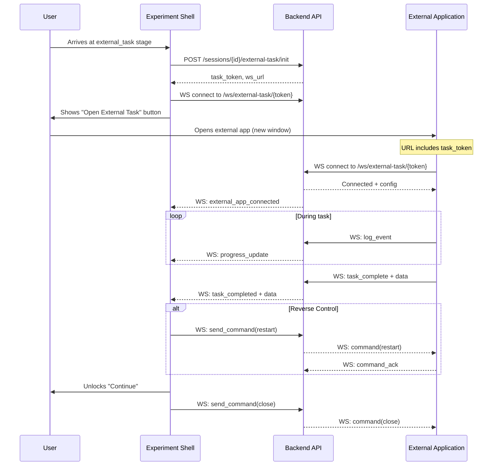

# External Task Stage Implementation

This plan implements a new `external_task` stage type for experiments that require participants to complete tasks on external web applications outside the experiment shell.

## YAML Stage Configuration

### Template Structure

A new file `experiments/external-task-template.yaml` will provide a reusable template:

```yaml
# External Task Stage Template
# Copy this stage configuration into your experiment YAML

- id: "external_task_example"
  type: "external_task"
  label: "External Task"
  title: "Complete External Task"
  description: "Please complete the task in the external application"
  mandatory: true
  
  # External application URL (required)
  # The task_token will be automatically appended as ?task_token=xxx
  target_url: "https://external-app.example.com/task"
  
  config:
    # Button configuration
    button_text: "Open Task"              # Text on the launch button
    button_open_text: "Task Opened"       # Text after window opened
    reopen_button_text: "Reopen Task"     # Text if window was closed
    
    # Completion behavior (required | optional | manual)
    # - required: Must wait for external app to signal completion
    # - optional: User can continue without completion (logged as incomplete)
    # - manual: User clicks "Mark as Done" button to proceed
    completion_mode: "required"
    
    # Timeout configuration
    timeout_ms: 0                         # Max time before timeout (0 = no timeout)
    timeout_action: "prompt"              # What happens on timeout:
                                          # - prompt: Show dialog with options
                                          # - skip: Auto-skip if stage not mandatory
                                          # - retry: Auto-restart the task
                                          # - fail: Mark as failed and block progress
    allow_retry_on_timeout: true          # Show "Try Again" button on timeout
    max_retries: 3                        # Max retry attempts (0 = unlimited)
    
    # Window management
    try_close_on_complete: true           # Attempt to close external window on completion
    window_mode: "popup"                  # Window mode:
                                          # - popup: Sized popup window
                                          # - fullscreen: Full monitor size
                                          # - tab: New browser tab
    window_width: 1200                    # Popup width (ignored for fullscreen/tab)
    window_height: 800                    # Popup height (ignored for fullscreen/tab)
    
    # UI messages
    waiting_message: "Waiting for task completion..."
    completed_message: "Task completed successfully!"
    timeout_message: "Task timed out. Would you like to try again?"
    
    # Pass additional data to external app via URL params
    pass_session_id: true                 # Include session_id in URL
    pass_stage_id: true                   # Include stage_id in URL
    custom_params:                        # Additional URL parameters
      study_name: "${PUBLIC.STUDY_NAME}"
      participant: "${session.participant_number}"
    
    # Reverse control (platform -> external app commands)
    enable_reverse_control: true          # Enable WebSocket commands to external app
    reverse_commands:                     # Available commands (external app must handle)
    - restart                           # Restart the task
    - close                             # Close/cleanup the task
    - pause                             # Pause the task (if supported)
    - resume                            # Resume the task (if supported)
```


### Minimal Configuration

```yaml
- id: "simple_external_task"
  type: "external_task"
  label: "External Survey"
  target_url: "https://survey.example.com"
  config:
    completion_mode: "required"
```


### Fullscreen Task Example

```yaml
- id: "fullscreen_game_task"
  type: "external_task"
  label: "Game Task"
  target_url: "https://game.example.com/experiment"
  config:
    completion_mode: "required"
    window_mode: "fullscreen"
    timeout_ms: 600000                    # 10 minutes
    timeout_action: "prompt"
    allow_retry_on_timeout: true
    max_retries: 2
    enable_reverse_control: true
```


## Architecture Overview

The system uses WebSocket for real-time bidirectional communication between all parties.




## External Application API Reference

External applications communicate via WebSocket for real-time bidirectional messaging.

### WebSocket Connection

```javascript
WS /api/ws/external-task/{task_token}
```


### Message Protocol

All messages are JSON with a `type` field:

```typescript
interface WebSocketMessage {
  type: string;
  payload?: any;
  timestamp?: string;
}
```


### Messages: External App -> Platform

#### 1. Ready (Required - send after connection)

```json
{ "type": "ready" }
```


#### 2. Log Event (Optional)

```json
{
  "type": "log",
  "payload": {
    "event_type": "user_action",
    "data": { "action": "clicked_button", "button_id": "submit" }
  }
}
```


#### 3. Progress Update (Optional)

```json
{
  "type": "progress",
  "payload": { "progress": 75, "step": "step_3" }
}
```


#### 4. Complete Task (Required)

```json
{
  "type": "complete",
  "payload": {
    "data": {
      "result": "success",
      "score": 95,
      "responses": { ... }
    }
  }
}
```


#### 5. Command Acknowledgment

```json
{
  "type": "command_ack",
  "payload": { "command": "restart", "success": true }
}
```


### Messages: Platform -> External App (Reverse Control)

#### 1. Init Config (sent on connection)

```json
{
  "type": "init",
  "payload": {
    "session_id": "uuid",
    "stage_id": "external_task_1",
    "config": { ... custom config from YAML ... },
    "participant_number": 42
  }
}
```


#### 2. Command: Restart

```json
{ "type": "command", "payload": { "command": "restart" } }
```


#### 3. Command: Close

```json
{ "type": "command", "payload": { "command": "close" } }
```


#### 4. Command: Pause/Resume

```json
{ "type": "command", "payload": { "command": "pause" } }
{ "type": "command", "payload": { "command": "resume" } }
```


#### 5. Custom Command

```json
{
  "type": "command",
  "payload": { "command": "custom", "action": "highlight_element", "data": { "elementId": "target" } }
}
```

---

## External App Integration Guide (JavaScript)

### Minimal Integration Example

```javascript
// external-task-client.js - Include this in your external application

class ExternalTaskClient {
  constructor() {
    this.ws = null;
    this.config = null;
    this.commandHandlers = {};
  }

  // Initialize connection using task_token from URL
  connect() {
    const urlParams = new URLSearchParams(window.location.search);
    const taskToken = urlParams.get('task_token');
    
    if (!taskToken) {
      console.error('No task_token found in URL');
      return;
    }

    // Connect to WebSocket (adjust base URL as needed)
    const wsProtocol = window.location.protocol === 'https:' ? 'wss:' : 'ws:';
    const wsUrl = `${wsProtocol}//${window.location.hostname}/api/ws/external-task/${taskToken}`;
    
    this.ws = new WebSocket(wsUrl);
    
    this.ws.onopen = () => {
      console.log('Connected to experiment platform');
      this.send({ type: 'ready' });
    };
    
    this.ws.onmessage = (event) => {
      const message = JSON.parse(event.data);
      this.handleMessage(message);
    };
    
    this.ws.onclose = () => {
      console.log('Disconnected from experiment platform');
    };
    
    this.ws.onerror = (error) => {
      console.error('WebSocket error:', error);
    };
  }

  // Handle incoming messages from platform
  handleMessage(message) {
    switch (message.type) {
      case 'init':
        this.config = message.payload;
        console.log('Received config:', this.config);
        this.onInit?.(this.config);
        break;
        
      case 'command':
        this.handleCommand(message.payload);
        break;
        
      default:
        console.log('Unknown message type:', message.type);
    }
  }

  // Handle commands from platform
  handleCommand(payload) {
    const { command, ...data } = payload;
    console.log('Received command:', command, data);
    
    const handler = this.commandHandlers[command];
    let success = false;
    
    if (handler) {
      try {
        handler(data);
        success = true;
      } catch (e) {
        console.error('Command handler error:', e);
      }
    } else {
      console.warn('No handler for command:', command);
    }
    
    // Acknowledge command
    this.send({
      type: 'command_ack',
      payload: { command, success }
    });
  }

  // Register command handler
  onCommand(command, handler) {
    this.commandHandlers[command] = handler;
  }

  // Send message to platform
  send(message) {
    if (this.ws?.readyState === WebSocket.OPEN) {
      this.ws.send(JSON.stringify({
        ...message,
        timestamp: new Date().toISOString()
      }));
    }
  }

  // Log an event
  logEvent(eventType, data = {}) {
    this.send({
      type: 'log',
      payload: { event_type: eventType, data }
    });
  }

  // Report progress (0-100)
  reportProgress(progress, step = null) {
    this.send({
      type: 'progress',
      payload: { progress, step }
    });
  }

  // Complete the task with results
  complete(data = {}) {
    this.send({
      type: 'complete',
      payload: { data }
    });
  }

  // Disconnect
  disconnect() {
    this.ws?.close();
  }
}

// Export for use
window.ExternalTaskClient = ExternalTaskClient;
```


### Usage in External Application

```html
<!DOCTYPE html>
<html>
<head>
  <title>External Task</title>
  <script src="external-task-client.js"></script>
</head>
<body>
  <div id="task-container">
    <!-- Your task UI here -->
    <button id="submit-btn">Submit</button>
  </div>

  <script>
    // Initialize client
    const client = new ExternalTaskClient();
    
    // Called when config is received from platform
    client.onInit = (config) => {
      console.log('Task started for participant:', config.participant_number);
      // Initialize your task with config
    };
    
    // Handle restart command
    client.onCommand('restart', () => {
      // Reset your task state
      resetTask();
    });
    
    // Handle close command
    client.onCommand('close', () => {
      // Cleanup and close window
      cleanup();
      window.close();
    });
    
    // Handle pause/resume
    client.onCommand('pause', () => pauseTask());
    client.onCommand('resume', () => resumeTask());
    
    // Connect to platform
    client.connect();
    
    // Log user interactions
    document.getElementById('submit-btn').addEventListener('click', () => {
      client.logEvent('button_click', { button: 'submit' });
    });
    
    // Report progress as user completes steps
    function onStepComplete(stepNumber, totalSteps) {
      const progress = (stepNumber / totalSteps) * 100;
      client.reportProgress(progress, `step_${stepNumber}`);
    }
    
    // When task is complete, send results
    function submitResults(results) {
      client.complete({
        result: 'success',
        score: results.score,
        responses: results.responses,
        duration_ms: results.duration
      });
    }
  </script>
</body>
</html>
```


### React Integration Example

```jsx
// useExternalTask.js - React hook for external task integration

import { useEffect, useRef, useState, useCallback } from 'react';

export function useExternalTask() {
  const clientRef = useRef(null);
  const [config, setConfig] = useState(null);
  const [isConnected, setIsConnected] = useState(false);

  useEffect(() => {
    const client = new window.ExternalTaskClient();
    clientRef.current = client;
    
    client.onInit = (cfg) => {
      setConfig(cfg);
      setIsConnected(true);
    };
    
    client.connect();
    
    return () => client.disconnect();
  }, []);

  const logEvent = useCallback((type, data) => {
    clientRef.current?.logEvent(type, data);
  }, []);

  const reportProgress = useCallback((progress, step) => {
    clientRef.current?.reportProgress(progress, step);
  }, []);

  const complete = useCallback((data) => {
    clientRef.current?.complete(data);
  }, []);

  const onCommand = useCallback((command, handler) => {
    clientRef.current?.onCommand(command, handler);
  }, []);

  return { config, isConnected, logEvent, reportProgress, complete, onCommand };
}

// Usage in component:
// const { config, isConnected, logEvent, complete, onCommand } = useExternalTask();
```


## Implementation Files

### Backend

- [`backend/app/models/external_task.py`](backend/app/models/external_task.py) - Pydantic models for external tasks
- [`backend/app/api/external_tasks.py`](backend/app/api/external_tasks.py) - REST API endpoints (init task, get status)
- [`backend/app/api/external_tasks_ws.py`](backend/app/api/external_tasks_ws.py) - WebSocket handler for real-time communication
- [`backend/app/models/event.py`](backend/app/models/event.py) - Add new event types for external tasks

### Frontend