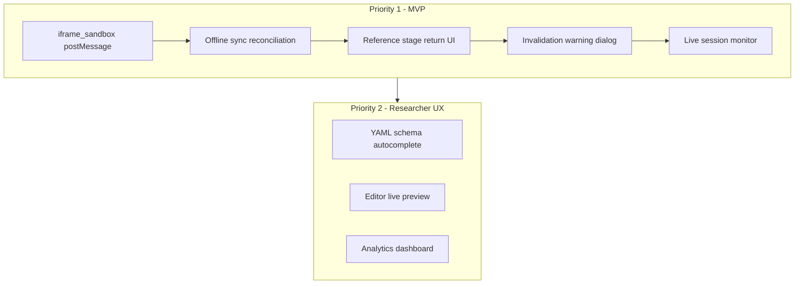

# MEOP Platform - Gap Analysis and Next Steps

## Current Implementation Status

### Implemented (Working)

**Backend Core (95% complete)**

- Auth system with JWT + roles (admin/researcher/viewer) - [`backend/app/api/auth.py`](backend/app/api/auth.py)
- Config engine with YAML validation and template flattening - [`backend/app/services/config_compiler.py`](backend/app/services/config_compiler.py)
- Session manager (backend-authoritative state machine) - [`backend/app/services/session_manager.py`](backend/app/services/session_manager.py)
- Asset service with S3/MinIO integration - [`backend/app/api/assets.py`](backend/app/api/assets.py)
- Event logging with idempotency keys - [`backend/app/api/logs.py`](backend/app/api/logs.py)
- Quota engine with Redis atomic operations - [`backend/app/services/quota_engine.py`](backend/app/services/quota_engine.py)
- Visibility engine for conditional branching - [`backend/app/services/visibility_engine.py`](backend/app/services/visibility_engine.py)
- Dependency graph for invalidation - [`backend/app/services/dependency_graph.py`](backend/app/services/dependency_graph.py)
- Data export (CSV wide/long, JSON) - [`backend/app/api/export.py`](backend/app/api/export.py)

**Experiment Shell (85% complete)**

- Core shell with progress bar, sidebar, navigation - [`frontend/experiment-shell/src/components/ExperimentShell.tsx`](frontend/experiment-shell/src/components/ExperimentShell.tsx)
- Block components: `user_info`, `questionnaire`, `content_display`, `video_player`, `likert_scale`, `consent_form`
- IndexedDB event queue for offline support - [`frontend/experiment-shell/src/lib/eventQueue.ts`](frontend/experiment-shell/src/lib/eventQueue.ts)
- Theming with CSS variables - [`frontend/experiment-shell/src/styles/themes.css`](frontend/experiment-shell/src/styles/themes.css)

**Admin Dashboard (70% complete)**

- Experiment list and CRUD operations - [`frontend/admin-dashboard/src/pages/ExperimentsPage.tsx`](frontend/admin-dashboard/src/pages/ExperimentsPage.tsx)
- YAML editor with Monaco - [`frontend/admin-dashboard/src/pages/ExperimentEditorPage.tsx`](frontend/admin-dashboard/src/pages/ExperimentEditorPage.tsx)
- Media Library with drag-drop upload - [`frontend/admin-dashboard/src/pages/AssetsPage.tsx`](frontend/admin-dashboard/src/pages/AssetsPage.tsx)
- Basic dashboard - [`frontend/admin-dashboard/src/pages/DashboardPage.tsx`](frontend/admin-dashboard/src/pages/DashboardPage.tsx)

---

## Missing Components (Priority Order)

### Priority 1: Critical for MVP

| Component | Location | Description ||-----------|----------|-------------|| iframe_sandbox postMessage | `experiment-shell/blocks/` | Missing bidirectional postMessage for completion triggers || Offline sync reconciliation | `experiment-shell/` | eventQueue syncs events but stage submission recovery is incomplete || Return from reference stage UI | `experiment-shell/` | Jump to reference works but "Return to Question X" button missing || Data invalidation warning dialog | `experiment-shell/` | No UI warning when editing causes downstream invalidation || Live session monitoring | `admin-dashboard/` | No real-time view of active sessions |

### Priority 2: Important for Researchers

| Component | Location | Description ||-----------|----------|-------------|| YAML schema autocomplete | `admin-dashboard/` | Monaco editor lacks custom YAML schema for stage types || Editor live preview | `admin-dashboard/` | No split view showing rendered experiment || Analytics dashboard UI | `admin-dashboard/` | Stats API exists but no visualization || Version history UI | `admin-dashboard/` | Versioning logic exists but no diff/rollback UI || attention_check block | `experiment-shell/` | Stage type defined but no block implementation |

### Priority 3: Nice to Have

| Component | Description ||-----------|-------------|| Visual Builder | One-way YAML generator with drag-drop (Phase 3B per plan) || Background workers | Dedicated worker processes instead of FastAPI BackgroundTasks || OAuth2/SSO | Google/institutional login || i18n support | Multi-language experiment content || Device fingerprinting | Prevent duplicate participations |---

## Recommended Next Steps

### Immediate Next Action

The most impactful single task is completing the **iframe_sandbox block** with proper postMessage communication, as this enables external JS tasks (a common experiment requirement).---

## Questions

Before proceeding with implementation:

1. **Which priority level** would you like to focus on first?