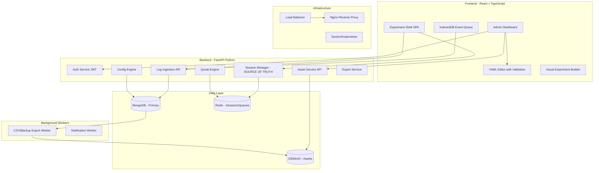
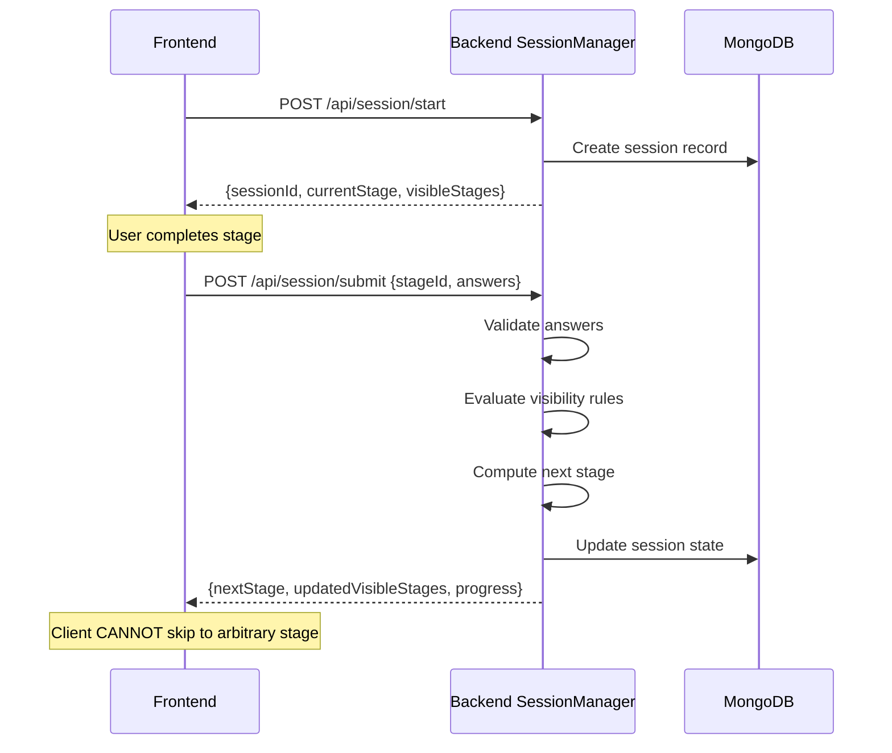
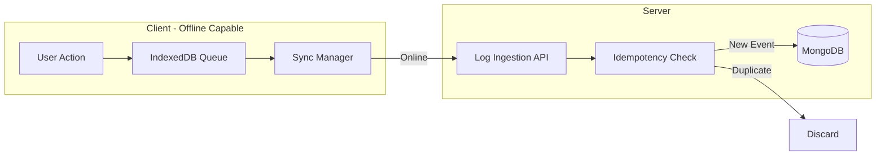
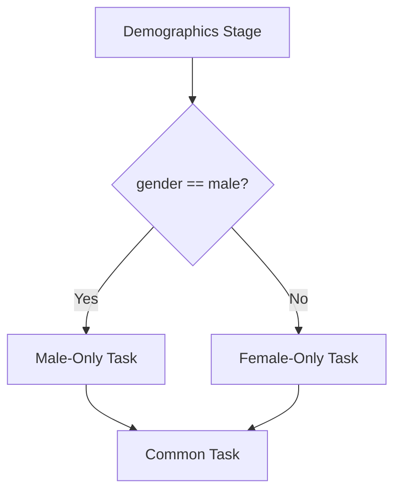
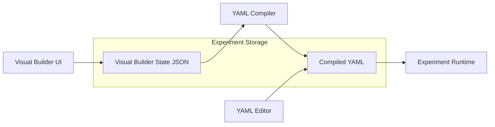
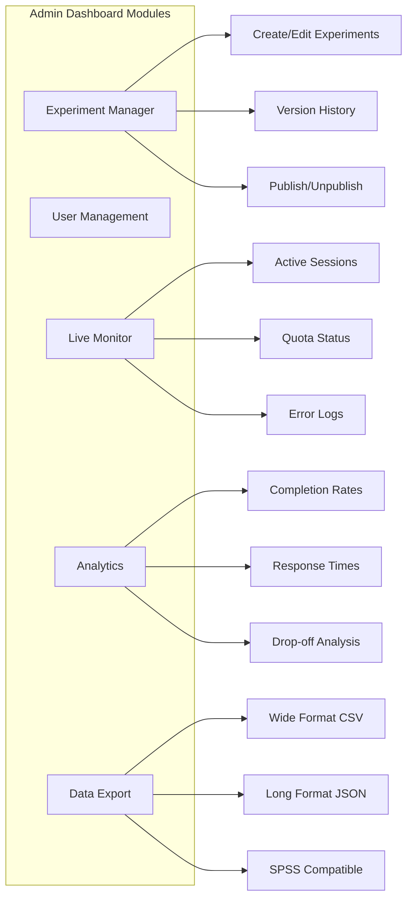
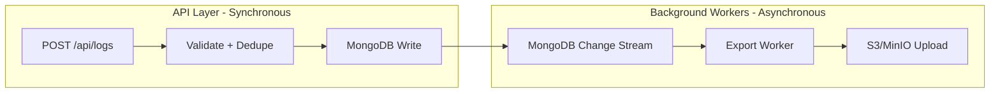

# MEOP - Modular Experiment Orchestration Platform

## Architecture Overview



**Key Architectural Principles:**

1. **Backend is Source of Truth** - Frontend never determines state transitions
2. **Single Write Path** - Logs write to MongoDB only; CSV export is async background job
3. **Decoupled Storage** - All assets stored in Object Storage (S3/MinIO), not local filesystem
4. **Offline-First Client** - IndexedDB queue for disconnected operation with idempotent sync

---

## Phase 1: Core Infrastructure and Backend

### 1.1 Project Structure

```javascript
/meop
├── docker-compose.yml
├── docker-compose.prod.yml
├── docker-compose.dev.yml
├── frontend/
│   ├── experiment-shell/      # Participant-facing SPA
│   └── admin-dashboard/       # Conductor GUI
├── backend/
│   ├── app/
│   │   ├── api/               # FastAPI routes
│   │   │   ├── auth.py
│   │   │   ├── experiments.py
│   │   │   ├── sessions.py    # State machine controller
│   │   │   ├── logs.py
│   │   │   └── assets.py      # Asset upload/retrieval
│   │   ├── core/              # Config, security, settings
│   │   ├── models/            # Pydantic schemas
│   │   ├── services/
│   │   │   ├── session_manager.py    # SOURCE OF TRUTH for state
│   │   │   ├── asset_service.py      # Object storage abstraction
│   │   │   ├── config_compiler.py    # Template flattening
│   │   │   └── dependency_graph.py   # Stage dependency tracking
│   │   ├── adapters/          # Storage adapters
│   │   │   ├── mongo_adapter.py
│   │   │   └── object_store.py       # S3/MinIO abstraction
│   │   ├── workers/           # Background job processors
│   │   │   ├── export_worker.py      # Async CSV/backup generation
│   │   │   └── cleanup_worker.py
│   │   └── validators/        # YAML/config validators
│   └── tests/
├── themes/                    # Semantic theme definitions
│   ├── clinical_blue.yaml
│   ├── dark_research.yaml
│   └── high_contrast.yaml
├── k8s/                       # Kubernetes manifests
└── nginx/                     # Reverse proxy config
```

**Note:** Assets (images, videos, HTML files) are stored in **Object Storage (S3/MinIO)**, not local filesystem. This enables horizontal scaling.

### 1.2 Authentication System (Full Auth with Roles)

**Roles:**

- **Admin**: Full access - manage users, experiments, view all logs
- **Researcher**: Create/edit own experiments, view own experiment logs
- **Viewer**: Read-only access to assigned experiments and their data

**Implementation:**

- JWT-based authentication with refresh tokens
- Password hashing with bcrypt
- Role-based route guards (backend) and protected routes (frontend)
- Optional: OAuth2 integration (Google, institutional SSO) for future

### 1.3 Configuration Engine

#### 1.3.1 Experiment Versioning & Immutability

Every save creates a new version. Experiments can be rolled back or compared.**Critical: Copy-on-Write for Templates (Reproducibility)**Templates can be extended during development, but **on publish**, the system flattens inheritance into an immutable snapshot:

```yaml
# Draft mode - inheritance allowed
meta:
  status: "draft"
  extends: "templates/standard_questionnaire.yaml"
  
# Published mode - fully flattened, immutable
meta:
  status: "published"
  version: "1.2.3"
  published_at: "2026-01-03T10:30:00Z"
  snapshot_id: "exp_abc123_v1.2.3"
  # All inherited content is inlined - no external references
```

This ensures that updating a template does NOT retroactively alter published experiments.

#### 1.3.2 Variable Interpolation (Security)

**CRITICAL: Client vs Server Variables**Variables in YAML are strictly namespaced to prevent secret leakage:| Prefix | Processed Where | Sent to Client | Use Case ||--------|-----------------|----------------|----------|| `${PUBLIC.*}` | Backend | Yes | Study name, researcher contact || `${URL.*}` | Frontend | Yes | URL parameters (?group=A) || `${SESSION.*}` | Frontend | Yes | Session ID, timestamp || `${SERVER.*}` | Backend | **NO** | API keys, webhook URLs |

```yaml
stages:
    - id: "welcome"
    content: "Welcome to ${PUBLIC.STUDY_NAME}"  # Safe - sent to client
    
    - id: "external_task"
    type: "iframe_sandbox"
    # WRONG - would leak API key to browser:
    # source: "https://api.example.com?key=${SERVER.API_KEY}"
    
    # CORRECT - backend proxies the request:
    source: "/api/proxy/external-task"
    server_config:  # This block is NEVER sent to client
      proxy_url: "https://api.example.com"
      api_key: "${SERVER.EXTERNAL_API_KEY}"
```


#### 1.3.3 Hot Reload (Development Only)

In development mode, YAML changes reflect immediately. In production, only published snapshots are served.---

### 1.4 Asset Service (Object Storage)

All user-uploaded assets are stored in Object Storage (S3/MinIO), enabling horizontal scaling.

#### 1.4.1 Asset API Endpoints

```javascript
POST   /api/assets/upload          # Upload file, returns asset_id
GET    /api/assets/{asset_id}      # Retrieve file (proxied from Object Store)
DELETE /api/assets/{asset_id}      # Delete file
GET    /api/assets/list?experiment_id=xxx  # List assets for experiment
```


#### 1.4.2 Asset References in YAML

Assets are referenced by ID, not path:

```yaml
# OLD (broken in scaled deployment):
content_file: "assets/html/consent.html"

# NEW (object storage):
content_file: "asset://exp_abc123/consent.html"
# Or by explicit ID:
content_asset_id: "asset_789xyz"
```


#### 1.4.3 Admin UI: Media Library

The Admin Dashboard includes a Media Library panel:

- Drag-and-drop upload
- Preview images/videos/HTML
- Copy asset reference to clipboard
- Organize by experiment or shared library

---

## Phase 2: Experiment Shell (Participant Frontend)

### 2.1 State Machine Architecture (Backend-Authoritative)

**CRITICAL: Backend is the Source of Truth**The frontend NEVER decides state transitions. This prevents manipulation via browser dev tools.




#### 2.1.1 Session API Endpoints

```javascript
POST   /api/session/start              # Initialize session, get first stage
POST   /api/session/submit             # Submit stage data, get next stage
POST   /api/session/event              # Log interaction event (non-blocking)
GET    /api/session/{id}/state         # Recover state after disconnect
POST   /api/session/{id}/jump          # Request jump to reference stage
```


#### 2.1.2 Client-Side State (Read-Only Mirror)

The frontend maintains a **read-only mirror** of server state for rendering:

```typescript
interface ClientSessionState {
  // Mirrored from server (read-only)
  sessionId: string;
  currentStageId: string;
  currentSubstepIndex: number;
  visibleStages: StageConfig[];      // Only stages user can see
  completedStageIds: string[];
  progress: { current: number; total: number };
  
  // Client-only (UI state)
  pendingSubmission: boolean;
  offlineQueue: QueuedEvent[];       // IndexedDB-backed
  isOffline: boolean;
}
```


#### 2.1.3 Offline Store-and-Forward Protocol

When connection is lost, participants can continue working. Events are queued locally and synced on reconnect.



**Implementation:**

1. **Client generates idempotency key** for each event: `{sessionId}_{stageId}_{eventType}_{timestamp}`
2. **Events stored in IndexedDB** with retry count
3. **On reconnect**, SyncManager batches events: `POST /api/session/sync`
4. **Server checks idempotency keys** - duplicates are silently accepted (200 OK) but not re-processed
5. **Server returns authoritative state** - client reconciles any drift
```typescript
interface QueuedEvent {
  idempotencyKey: string;
  timestamp: number;
  stageId: string;
  eventType: string;
  payload: Record<string, unknown>;
  retryCount: number;
  syncedAt: number | null;
}
```


**Offline Limitations:**

- Stage submissions require server validation - queued but not confirmed until online
- Quota-limited stages cannot be accessed offline (no reservation possible)
- Progress indicator shows "Offline - will sync when connected"

---

### 2.2 Shell GUI Configuration (Theming & Layout)

The Experiment Shell appearance is configurable via YAML using **Semantic Themes** - not raw CSS values.

#### 2.2.1 Semantic Theme System (Maintainability)

**Why Semantic Themes?**Hardcoding colors (`#2563eb`) in experiment configs creates technical debt:

- Frontend redesigns require migrating every experiment config
- Dark mode support becomes impossible
- Accessibility improvements can't be rolled out

**Solution: Theme References**Experiments reference named themes. The frontend maps these to CSS variables.

```yaml
# In experiment.yaml - CORRECT approach
shell_config:
  theme: "clinical_blue"           # Reference to theme definition
  
  # Optional overrides for branding only
  branding:
    logo: "asset://exp_abc123/logo.png"
    favicon: "asset://exp_abc123/favicon.ico"
    title_template: "{{experiment_name}} - {{current_stage}}"
```

**Built-in Themes (defined in /themes/ directory):**| Theme Name | Description | Use Case ||------------|-------------|----------|| `clinical_blue` | Clean, professional blue | Medical/clinical studies || `academic_neutral` | Neutral grays, minimal | University research || `high_contrast` | WCAG AAA compliant | Accessibility required || `dark_research` | Dark mode, reduced eye strain | Long sessions || `playful_warm` | Warm colors, friendly | Consumer/UX research |**Theme Definition File (themes/clinical_blue.yaml):**

```yaml
# This file is managed by developers, not researchers
name: "clinical_blue"
description: "Professional clinical study theme"

tokens:
  colors:
    primary: "#2563eb"
    primary_hover: "#1d4ed8"
    secondary: "#64748b"
    background: "#f8fafc"
    surface: "#ffffff"
    text_primary: "#1e293b"
    text_secondary: "#64748b"
    success: "#22c55e"
    warning: "#f59e0b"
    error: "#ef4444"
    
  typography:
    font_heading: "Inter, system-ui, sans-serif"
    font_body: "Inter, system-ui, sans-serif"
    font_mono: "JetBrains Mono, monospace"
    
  spacing:
    border_radius: "8px"
    spacing_unit: "4px"
```

**Custom Themes:**Researchers needing custom branding can request a new theme be added to the system, or admins can create institution-specific themes.

#### 2.2.2 Layout Configuration

````yaml
shell_config:
  layout:
    max_width: "800px"            # Content max width
    content_alignment: "center"   # "center" | "top"
    sidebar_position: "left"      # "left" | "right" | "none"
    
  responsive:
    mobile_optimized: true        # Enable responsive breakpoints
    collapse_sidebar_mobile: true # Sidebar becomes hamburger menu


#### 2.2.2 Progress Indicators Configuration

```yaml
shell_config:
  progress:
    # Page Title Progress
    show_in_title: true           # "Study Name - Stage 2 of 5"
    title_format: "{{experiment_name}} - {{stage_label}} ({{current}}/{{total}})"
    
    # Top Progress Bar
    show_progress_bar: true
    progress_bar_position: "top"  # "top" | "bottom" | "none"
    progress_bar_style: "continuous"  # "continuous" | "segmented"
    show_percentage: false
    
    # Stage/Question Counter
    show_counter: true
    counter_position: "top-right" # "top-left" | "top-right" | "bottom-left" | "bottom-right"
    counter_format: "Question {{current}} of {{total}}"
    
    # Sidebar Navigation (Optional)
    sidebar:
      enabled: true               # Show sidebar with step list
      position: "left"            # "left" | "right"
      width: "280px"
      collapsed_on_mobile: true   # Auto-collapse on small screens
      show_completed_checkmarks: true
      show_step_numbers: true
      clickable_completed: true   # Allow clicking to jump back
      highlight_current: true
      show_substeps: true         # Show sub-stages nested under stages
````

**Progress Sidebar Visual Structure:**

```javascript
┌─────────────────────────────────────────────────────────────┐
│  [Logo]  Study Title                                        │
├──────────────┬──────────────────────────────────────────────┤
│              │                                              │
│  PROGRESS    │                                              │
│              │                                              │
│  ✓ 1. Consent│         [Current Stage Content]             │
│  ✓ 2. Demographics                                          │
│     • Name   │                                              │
│     • Age    │                                              │
│  ► 3. Task A │         Question 2 of 5                     │
│     • Intro  │         ━━━━━━━━━━━░░░░░ 40%                │
│     • Video  │                                              │
│    ● Questions                                              │
│  ○ 4. Task B │                                              │
│  ○ 5. Debrief│                                              │
│              │                                              │
├──────────────┴──────────────────────────────────────────────┤
│  [Back]                                    [Next →]         │
└─────────────────────────────────────────────────────────────┘

Legend: ✓ completed  ► current stage  ● current substep  ○ upcoming
```


#### 2.2.3 Navigation Configuration

```yaml
shell_config:
  navigation:
    # Button Labels (i18n support)
    labels:
      next: "Continue"
      back: "Back"
      submit: "Submit"
      finish: "Complete Study"
    
    # Back Navigation
    allow_back: true              # Global toggle
    back_button_position: "left"  # "left" | "right" | "both"
    
    # Jump Navigation (Internal Links)
    allow_jump_to_completed: true # Jump to any completed stage
    allow_jump_to_reference: true # Jump to reference stages (info blocks)
    return_to_current: true       # Auto-return button after jumping
    jump_warning: true            # Warn before jumping ("You will return to Question 3")
    
    # Keyboard Shortcuts
    keyboard_shortcuts:
      enabled: true
      next: "Enter"
      back: "Backspace"
```

---

### 2.3 User Info Block (Standard Demographics)

A standardized, reusable block for collecting participant information. This is typically the first step after consent and can influence later stage visibility through conditional logic.

#### 2.3.1 Built-in User Info Template

The system provides a pre-built `user_info` block type that handles common demographic fields:

```yaml
stages:
                - id: "user_info"
    type: "user_info"            # Special block type
    mandatory: true
    
    # Select which fields to collect
    fields:
      # Identity Fields
                                                - field: "full_name"
        label: "Full Name"
        type: "text"
        required: true
        
                                                - field: "participant_id"
        label: "ID Number"
        type: "text"
        required: true
        validation: "^[0-9]{9}$"  # Regex pattern
        validation_message: "Please enter a valid 9-digit ID"
        
                                                - field: "email"
        label: "Email Address"
        type: "email"
        required: false
        
      # Demographic Fields
                                                - field: "age"
        label: "Age"
        type: "number"
        min: 18
        max: 120
        required: true
        
                                                - field: "gender"
        label: "Gender"
        type: "select"
        options:
                                                                                - value: "male"
            label: "Male"
                                                                                - value: "female"
            label: "Female"
                                                                                - value: "other"
            label: "Other"
                                                                                - value: "prefer_not"
            label: "Prefer not to say"
        required: true
        
      # Group Assignment Fields (for conditional branching)
                                                - field: "education"
        label: "Highest Education Level"
        type: "select"
        options:
                                                                                - value: "high_school"
            label: "High School"
                                                                                - value: "bachelors"
            label: "Bachelor's Degree"
                                                                                - value: "masters"
            label: "Master's Degree"
                                                                                - value: "phd"
            label: "PhD"
        required: true
        # This value can be used in visibility rules for later stages
        
                                                - field: "specialization"
        label: "Your Field of Study"
        type: "select"
        options:
                                                                                - value: "stem"
            label: "STEM (Science, Technology, Engineering, Math)"
                                                                                - value: "humanities"
            label: "Humanities & Social Sciences"
                                                                                - value: "business"
            label: "Business & Economics"
                                                                                - value: "arts"
            label: "Arts & Design"
                                                                                - value: "other"
            label: "Other"
        required: true
```


#### 2.3.2 Using Demographics for Conditional Branching

After collecting user info, later stages can use these values in visibility rules:

```yaml
stages:
                - id: "user_info"
    type: "user_info"
    fields:
                                                - field: "specialization"
        type: "select"
        options:
                                                                                - value: "stem"
            label: "STEM"
                                                                                - value: "humanities"
            label: "Humanities"
        required: true

  # This stage only shows for STEM participants
                - id: "technical_task"
    type: "questionnaire"
    visibility_rule: "user_info.specialization == 'stem'"
    questions:
                                                - id: "coding_experience"
        text: "Rate your programming experience"
        type: "likert_scale"
        range: [1, 5]

  # This stage only shows for Humanities participants
                - id: "reading_task"
    type: "content_display"
    visibility_rule: "user_info.specialization == 'humanities'"
    content_file: "assets/html/reading_passage.html"

  # This stage shows for everyone
                - id: "common_survey"
    type: "questionnaire"
    visibility_rule: "true"  # Always visible
    questions:
      # ... common questions
```


#### 2.3.3 Pre-built Field Types

| Field Type | Description | Validation ||------------|-------------|------------|| `text` | Single line text input | Optional regex pattern || `textarea` | Multi-line text | Max length || `email` | Email input | Email format validation || `number` | Numeric input | Min/max values || `date` | Date picker | Min/max date || `select` | Dropdown selection | Options list || `radio` | Radio button group | Options list || `checkbox` | Multiple selection | Options list || `phone` | Phone number | Country-specific format |---

### 2.4 Internal Navigation & Reference Stages

Allow participants to jump back to previously completed stages (e.g., re-read instructions) and return to their current position.**CRITICAL: Dependency Graph for Data Integrity**

#### 2.4.1 The Problem: Cascading Invalidation

If a user jumps back to Stage 1 (Demographics) and changes "Gender" from Male to Female, but Stage 3 was a "Male-only task" they already completed, the dataset becomes corrupted.

#### 2.4.2 Solution: Dependency Graph

The system builds a **Dependency Graph** at experiment load time. When upstream data changes, all dependent downstream data is invalidated.



**Implementation:**

```python
# Backend: dependency_graph.py
class DependencyGraph:
    def __init__(self, experiment_config):
        self.nodes = {}  # stage_id -> StageNode
        self.edges = {}  # stage_id -> list of dependent stage_ids
        self._build_graph(experiment_config)
    
    def get_dependents(self, stage_id: str) -> List[str]:
        """Returns all stages that depend on this stage (directly or transitively)"""
        ...
    
    def invalidate_downstream(self, changed_stage_id: str, session: Session):
        """
        When a stage's data changes:
                1. Find all dependent stages
                2. Mark their data as invalidated
                3. Force user to re-traverse those stages
        """
        dependents = self.get_dependents(changed_stage_id)
        for dep_id in dependents:
            session.invalidate_stage(dep_id)
        return dependents
```

**User Experience on Edit:**

```javascript
┌─────────────────────────────────────────────────────────────┐
│  ⚠️ Warning: Changing Your Answer                           │
│                                                             │
│  You previously selected "Male" and completed tasks         │
│  designed for male participants.                            │
│                                                             │
│  If you change your answer to "Female":                     │
│  • Your answers to "Male-Only Task" will be discarded       │
│  • You will need to complete "Female-Only Task" instead     │
│                                                             │
│  [Keep Original Answer]     [Change and Re-do Tasks]        │
└─────────────────────────────────────────────────────────────┘
```


#### 2.4.3 Reference Stages (Read-Only Jump)

Reference stages are **read-only** - viewing them does NOT trigger invalidation:

```yaml
stages:
    - id: "instructions"
    type: "content_display"
    content_asset_id: "asset_instructions_html"
    reference: true              # Can be jumped to anytime
    reference_label: "View Instructions"
    editable: false              # Read-only, no invalidation risk
    
    - id: "task_info"
    type: "content_display"
    content: "Task rules and guidelines..."
    reference: true
    reference_label: "Task Rules"
```


#### 2.4.4 Editable vs Non-Editable Stages

```yaml
stages:
    - id: "demographics"
    type: "user_info"
    editable_after_submit: true    # User CAN go back and change
    invalidates_dependents: true   # Changing will wipe dependent data
    
    - id: "consent"
    type: "consent_form"
    editable_after_submit: false   # Once submitted, cannot change
    
    - id: "timed_task"
    type: "iframe_sandbox"
    editable_after_submit: false   # Timed tasks cannot be redone
```


#### 2.4.5 Jump Navigation UI

```javascript
┌─────────────────────────────────────────────────────────────┐
│  📖 Reference Materials        [Current: Question 5 of 10] │
│  ┌─────────────────┐ ┌─────────────────┐                   │
│  │ 📋 Instructions │ │ 📝 Task Rules   │                   │
│  └─────────────────┘ └─────────────────┘                   │
├─────────────────────────────────────────────────────────────┤
│                                                             │
│                  [Current Stage Content]                    │
│                                                             │
└─────────────────────────────────────────────────────────────┘
```

When user clicks a reference link:

1. Current position is saved (server-side)
2. Reference stage is displayed (read-only)
3. "Return to Question 5" button appears prominently
4. User clicks return → back to exact position

---

### 2.5 Component Library (Blocks)

| Block Type | Description | Completion Trigger ||------------|-------------|-------------------|| `user_info` | Standardized demographics collection | All required fields filled || `questionnaire` | Questions with various input types | All required questions answered || `content_display` | Text, HTML, or rich content | Timer expires or user clicks Next || `video_player` | Video with full playback control | Configurable: `MEDIA_ENDED`, `MEDIA_PAUSED`, or manual || `iframe_sandbox` | External JS tasks | `postMessage` from iframe || `likert_scale` | Visual faces 1-5 or 1-7 | Selection made || `consent_form` | Legal consent with checkbox | Checkbox checked || `attention_check` | Hidden validation questions | Correct answer given |---

### 2.6 Block Specifications (Detailed)

#### 2.6.1 Video Player Block

The video player supports bidirectional communication with the Shell for full playback control and event logging.**Events Emitted (Block to Shell):**

- `VIDEO_PLAY` - User started/resumed playback
- `VIDEO_PAUSE` - User paused playback
- `VIDEO_SEEK` - User seeked to position (includes `fromTime`, `toTime`)
- `VIDEO_ENDED` - Video reached the end
- `VIDEO_PROGRESS` - Periodic progress updates (configurable interval)
- `VIDEO_FULLSCREEN_ENTER` / `VIDEO_FULLSCREEN_EXIT`

**Commands Received (Shell to Block):**

- `CMD_PLAY` - Start/resume playback
- `CMD_PAUSE` - Pause playback
- `CMD_SEEK` - Seek to specific time
- `CMD_MUTE` / `CMD_UNMUTE`

**YAML Configuration Example:**

```yaml
- id: "stimulus_video"
  type: "video_player"
  source: "assets/videos/stimulus_01.mp4"
  config:
    autoplay: false
    controls: true              # Show native controls
    allow_seek: false           # Disable seeking (for controlled viewing)
    allow_pause: true
    log_progress_interval: 5000 # Log progress every 5 seconds
  completion_trigger: "MEDIA_ENDED"  # or "MEDIA_PAUSED", "manual"
```


#### 2.6.2 Content Display Block (Text/HTML)

This block handles all static content display. Content can be defined in **three ways**:**Option A: Inline Text (Simple)**For short text, define directly in YAML:

```yaml
- id: "welcome_text"
  type: "content_display"
  content_type: "text"
  content: |
    Welcome to this experiment.
    Please read the instructions carefully before proceeding.
```

**Option B: Inline HTML (Formatted)**For formatted content with styling:

```yaml
- id: "instructions"
  type: "content_display"
  content_type: "html"
  content: |
    <h2>Instructions</h2>
    <p>In this task, you will see a series of <strong>images</strong>.</p>
    <ul>
      <li>Press <kbd>A</kbd> for option 1</li>
      <li>Press <kbd>B</kbd> for option 2</li>
    </ul>
```

**Option C: External File Reference**For complex HTML pages or reusable content:

```yaml
- id: "detailed_consent"
  type: "content_display"
  content_type: "file"
  content_file: "assets/html/consent_form.html"  # Relative to experiment root
```

**Option D: Rich Text (For Visual Builder - Future)**When using the visual builder, content will be stored as structured rich text:

```yaml
- id: "welcome"
  type: "content_display"
  content_type: "rich_text"
  content:
    blocks:
                                                - type: "heading"
        level: 2
        text: "Welcome"
                                                - type: "paragraph"
        text: "Thank you for participating."
                                                - type: "image"
        src: "assets/images/logo.png"
        alt: "Study Logo"
```

**Content Storage Summary:**| Content Type | Storage Location | Use Case ||--------------|------------------|----------|| `text` | Inline in YAML | Short instructions, labels || `html` | Inline in YAML | Formatted text with basic HTML || `file` | `assets/html/*.html` | Complex pages, reusable content || `rich_text` | Inline structured JSON | Visual builder output |**File Storage Structure:**

```javascript
/experiment-root
├── config/
│   └── experiment.yaml
├── assets/
│   ├── html/           # HTML content files
│   │   ├── consent.html
│   │   └── debrief.html
│   ├── images/         # Image assets
│   ├── videos/         # Video files
│   └── styles/         # Optional custom CSS
```


### 2.7 Additional Improvements

1. **Attention Check System**: Built-in attention check questions that can invalidate sessions if failed repeatedly.
2. **Device Fingerprinting**: Prevent same user from taking experiment multiple times (beyond cookies).
3. **Accessibility Compliance**: WCAG 2.1 AA compliance - screen reader support, keyboard navigation, high contrast mode.
4. **Internationalization (i18n)**: Multi-language support for experiment content.
5. **Responsive Design**: Mobile-first approach with configurable breakpoints. All blocks must render correctly on phones, tablets, and desktops.

---

## Phase 3: Admin Dashboard (Conductor GUI)

### 3.1 YAML Editor (Priority - Phase 3A)

**Features:**

- Monaco Editor (VS Code's editor) with custom YAML schema
- Real-time syntax validation with error highlighting
- Autocomplete for stage types, properties, and references
- Split view: Editor | Live Preview
- Schema documentation sidebar
- Import/Export configurations

### 3.2 Visual Experiment Builder (Future - Phase 3B)

**CRITICAL: One-Way Generator Architecture**Visual builders are inherently destructive - they cannot represent all YAML features. Opening a hand-coded YAML in the visual builder would strip custom logic.**Solution: Separate Storage Model**



**Rules:**

1. **Visual Builder is a One-Way Generator** - it outputs YAML but cannot import arbitrary YAML
2. **Visual State stored separately** - `experiment_visual.json` contains the builder's internal representation
3. **YAML is the canonical format** - the compiled `experiment.yaml` is what runs
4. **Mode lock** - experiments are either "Visual Mode" or "Code Mode", not both:

- Visual Mode: Edit in builder, YAML is read-only (auto-generated)
- Code Mode: Edit YAML directly, visual builder is disabled

**Visual Builder Features:**

- Drag-and-drop stage ordering
- Visual flow editor showing conditional branching
- Component palette with pre-built blocks
- Property panels for each stage/block
- Live preview panel
- Export to YAML (one-way)
- "Eject to Code Mode" button (irreversible)

### 3.3 Dashboard Features



---

## Phase 4: Logging and Telemetry

### 4.1 Event Schema

```typescript
interface ExperimentEvent {
  eventId: string;          // UUIDv4
  idempotencyKey: string;   // For offline sync deduplication
  timestamp: string;        // ISO 8601
  userId: string;           // Persistent across sessions
  sessionId: string;        // Per experiment run
  experimentId: string;     // From YAML meta
  stageId: string;
  blockId?: string;
  eventType: 'click' | 'submit' | 'view' | 'timeout' | 'error' | 'custom';
  payload: Record<string, unknown>;
  metadata: {
    userAgent: string;
    screenSize: string;
    referrer?: string;
    urlParams?: Record<string, string>;
  };
}
```


### 4.2 Single-Write Architecture (NOT Dual-Write)

**CRITICAL: Avoiding the Dual-Write Anti-Pattern**The original design showed synchronous writes to both MongoDB and CSV. This is problematic:

1. No transaction rollback if CSV fails after MongoDB succeeds
2. File I/O blocks the API under load
3. Local CSV files don't work in scaled deployments (multiple containers)

**Correct Architecture: Write-Through with Async Backup**



**Implementation:**

```python
# api/logs.py - Synchronous, fast
@router.post("/api/logs")
async def ingest_log(event: ExperimentEvent):
    # 1. Check idempotency key (Redis) - prevent duplicates from offline sync
    if await redis.exists(f"idem:{event.idempotencyKey}"):
        return {"status": "duplicate_accepted"}
    
    # 2. Write ONLY to MongoDB (fast, reliable)
    await mongo.events.insert_one(event.dict())
    
    # 3. Mark idempotency key as processed (TTL: 24h)
    await redis.setex(f"idem:{event.idempotencyKey}", 86400, "1")
    
    return {"status": "accepted"}
```


```python
# workers/export_worker.py - Asynchronous, runs separately
async def export_worker():
    """
    Watches MongoDB change stream and exports to backup storage.
    Runs as separate process/container.
    """
    async with mongo.events.watch() as stream:
        async for change in stream:
            event = change["fullDocument"]
            
            # Export to S3/MinIO as JSON Lines
            await s3.append_to_file(
                bucket="experiment-logs",
                key=f"{event['experimentId']}/{event['sessionId']}.jsonl",
                data=json.dumps(event) + "\n"
            )
            
            # Optionally: Generate periodic CSV snapshots
            await schedule_csv_export_if_needed(event['experimentId'])
```


### 4.3 Backup & Export Strategy

| Storage | Purpose | Write Timing | Format ||---------|---------|--------------|--------|| MongoDB | Primary, real-time queries | Synchronous | JSON Documents || S3/MinIO | Backup, archival | Async (seconds) | JSON Lines || CSV | Researcher download | On-demand export | Wide/Long format |**On-Demand CSV Export:**

```javascript
GET /api/export/{experiment_id}?format=wide&stages=demographics,task_1
```

This generates a CSV file in **Wide Format** (1 row per participant) from MongoDB data - NOT from pre-written CSV files.---

## Phase 5: Deployment Options

### 5.1 Local Docker (Development/Small Scale)

```yaml
# docker-compose.yml
services:
  frontend:
    build: ./frontend
    ports: ["3000:3000"]
  backend:
    build: ./backend
    ports: ["8000:8000"]
  mongo:
    image: mongo:7
    volumes: ["mongo_data:/data/db"]
  redis:
    image: redis:alpine
```


### 5.2 Single Cloud Server (Production)

- Nginx reverse proxy with SSL (Let's Encrypt)
- Systemd services or Docker Compose with restart policies
- Automated backups to object storage

### 5.3 Scalable Cloud (High Concurrency)

- Kubernetes manifests or Docker Swarm
- Horizontal scaling for backend pods
- MongoDB Atlas or managed database
- Redis Cluster for distributed quota management
- CDN for static assets

---

## Architectural Fixes Applied

This section documents critical architectural corrections made to ensure scalability, data integrity, and security.

### Fixed: Dual-Write Anti-Pattern

| Before (Flawed) | After (Correct) ||-----------------|-----------------|| Synchronous write to MongoDB AND CSV | Single write to MongoDB only || CSV on local filesystem | Async export worker writes to S3/MinIO || No rollback on partial failure | Atomic single-write, no consistency risk || Blocks API under load | Non-blocking, scalable |

### Fixed: Local Asset Bottleneck

| Before (Flawed) | After (Correct) ||-----------------|-----------------|| `assets/` folder on local filesystem | S3/MinIO Object Storage || 404 errors in scaled deployment | Assets accessible from any instance || Manual file placement | Asset Service API with upload endpoints |

### Fixed: Client-Side Secret Leakage

| Before (Flawed) | After (Correct) ||-----------------|-----------------|| `${ENV.VARIABLE}` sent to browser | Namespaced: `${PUBLIC.*}` vs `${SERVER.*}` || API keys exposed in frontend | Server-only variables never sent to client |

### Fixed: Split-Brain State Management

| Before (Flawed) | After (Correct) ||-----------------|-----------------|| Frontend controls state transitions | Backend is Source of Truth || Participant can manipulate via DevTools | Server validates and returns next state || Race conditions on state | Atomic server-side transitions |

### Fixed: Template Inheritance (Reproducibility)

| Before (Flawed) | After (Correct) ||-----------------|-----------------|| Live inheritance (`extends:`) | Copy-on-Write: flatten on publish || Updating template alters history | Published experiments are immutable snapshots |

### Fixed: CSS-in-YAML (Maintainability)

| Before (Flawed) | After (Correct) ||-----------------|-----------------|| Hardcoded colors in experiment config | Semantic themes (`theme: "clinical_blue"`) || Frontend redesign requires data migration | Theme definitions separate from experiments |

### Fixed: Visual Builder Round-Trip

| Before (Flawed) | After (Correct) ||-----------------|-----------------|| Visual builder can import/export YAML | One-way generator only || Hand-coded YAML gets mangled | Separate visual state storage || Mode ambiguity | Mode lock: Visual OR Code, not both |

### Added: Missing Specifications

| Gap | Solution Added ||-----|----------------|| Asset Management API | Section 1.4 - Asset Service with upload/retrieve endpoints || Offline Store-and-Forward | Section 2.1.3 - IndexedDB queue with idempotency keys || Jump-Back Data Invalidation | Section 2.4.2 - Dependency Graph with cascading invalidation |---

## Technology Stack (Final)

| Layer | Technology | Justification ||-------|-----------|---------------|| Frontend Shell | React 18 + TypeScript + Zustand | Type safety, fast renders, simple state || Frontend Admin | React 18 + TypeScript + TanStack Query | Caching, server state management || Offline Storage | IndexedDB (Dexie.js) | Persistent client-side queue for offline || Editor | Monaco Editor | VS Code quality, YAML support || Backend | FastAPI (Python 3.11+) | Async, auto-docs, Pydantic validation || Auth | JWT + bcrypt | Stateless, secure || Primary DB | MongoDB 7 | Flexible schema for varied experiment data || Cache/Sessions | Redis | Atomic operations, idempotency keys, quotas || Object Storage | S3 / MinIO | Assets, backup logs, scalable || Background Jobs | Python asyncio + MongoDB Change Streams | Export worker, notifications || Infra | Docker Compose / Kubernetes | Dev simplicity / Prod scalability || Proxy | Nginx + Load Balancer | SSL termination, horizontal scaling |---

## Implementation Order

1. **Phase 1**: Core Infrastructure (Docker, FastAPI, MongoDB, Redis, MinIO)
2. **Phase 2**: Auth System + Config Engine with template flattening
3. **Phase 3**: Asset Service + Session Manager (backend-authoritative)
4. **Phase 4**: Experiment Shell with offline support
5. **Phase 5**: Admin Dashboard with YAML Editor
6. **Phase 6**: Logging system with async export worker